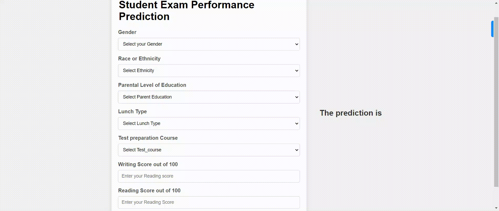

## End to End Machine Learning Project

### Predicting Student Performance

Information About the Dataset:

**The dataset** The goal of this project is to understand the influence of the parents background, test preparation, and various other variables on the students math score.

There are 8 independent variables:

- `gender` : Sex of a student (Male/Female)
- `race/ethnicity` : Ethnicity of a student (Group A,B,C,D,E)
- `parental level of education` : parents' final education (bachelor's degree,some college,master's degree,associate's degree,high school)
- `lunch` : What type of lunch the student had before test (standard or free/reduced)
- `test preparation course` : Whether the student completed any preparation course before the test.
- `reading score` : Reading score obtained by the student.
- `writing score` : Writing score obtained by the student.

### Project Development Approach

1. Data Ingestion :

   - In Data Ingestion phase the data is first read as csv.
   - Then the data is split into training and testing and saved as csv file.

2. Data Transformation :

   - Implemented SimpleImputer with a median strategy for handling outliers in Numeric Variables, followed by standard scaling.
   - Applied SimpleImputer with a most frequent strategy for Categorical Variables, performed one-hot encoding, and scaled the data using a standard scaler.
   - Saved the resulting preprocessor as a pkl file in the artifacts folder.

3. Model Training :

   - Conducted training and evaluation for all models in this phase, with Linear Regression identified as the optimal model.
   - Subsequently, performed hyperparameter tuning to enhance model performance.
   - The finalized model is saved as a pickle file for utilization in the prediction pipeline.

4. Prediction Pipeline :
  - Developed a pipeline that transforms input data into a dataframe and incorporates  functions for loading pickle files and predicting final results in Python.

5. Flask App creation :
   - Built a Flask app with User Interface to predict the math score of a student given the required features inside a Web Application.

### UI Animation

### Run
`python application.py`

